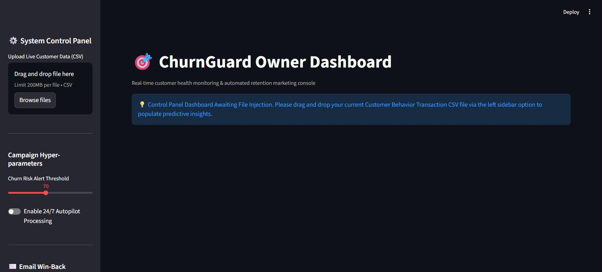
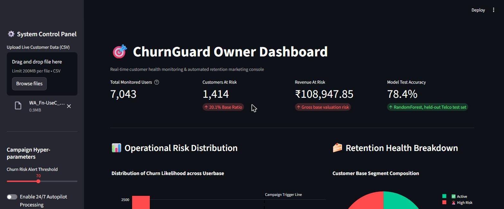
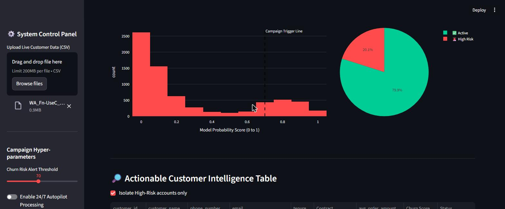
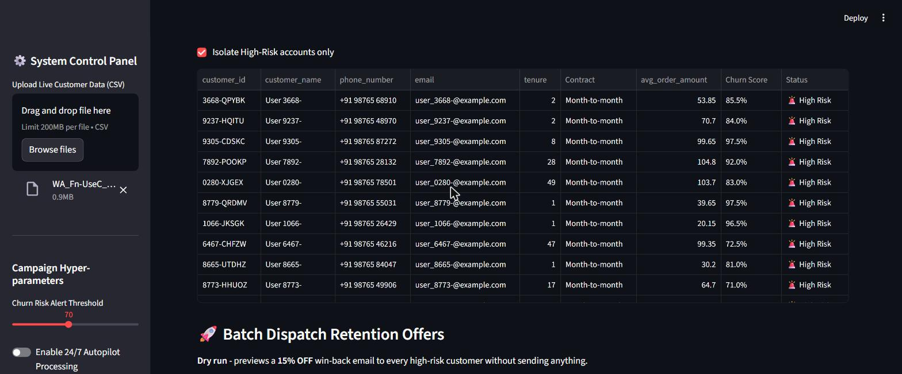
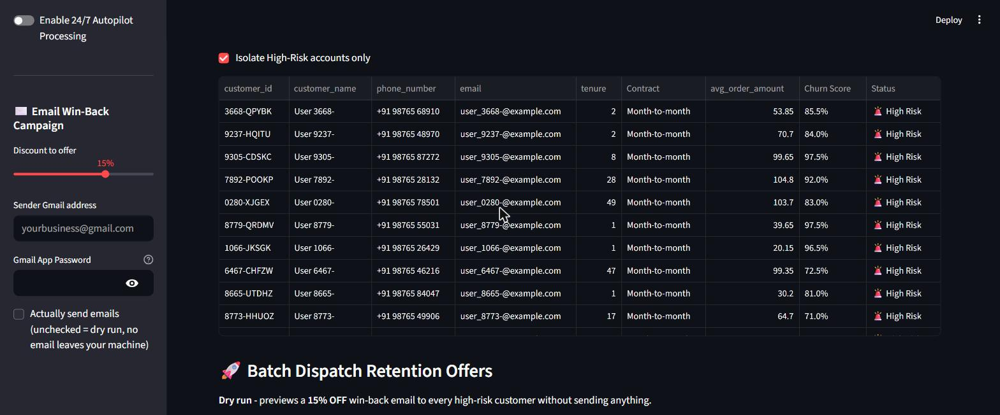

# ChurnGuard — Customer Churn Predictor & Retention Dashboard

A Streamlit dashboard that scores customers for churn risk using a real Random Forest
model, then lets you dispatch a discount win-back email campaign to the customers most
likely to leave.

Built on the classic [Telco Customer Churn dataset](https://www.kaggle.com/datasets/blastchar/telco-customer-churn)
(7,043 real telecom customers). Everything in the dashboard — the scores, the KPIs, the
risk table — comes from genuine model inference on real data. Nothing is randomly
generated or simulated.

---

## Features

- **Real ML inference** — a `RandomForestClassifier` (class-balanced, 200 trees) trained
  on the actual dataset, not a stub. Test accuracy and a full classification report are
  computed at training time and surfaced in the dashboard.
- **Upload any Telco-formatted CSV** and get live churn probabilities per customer.
- **Executive KPI board** — total customers, at-risk count, revenue at risk, model test
  accuracy.
- **Risk distribution histogram** and **active vs. high-risk pie chart** (Plotly).
- **Actionable customer table** — filterable to high-risk accounts only, sortable, with
  churn score and contract/tenure/spend context.
- **Email win-back campaign** — sends a real HTML discount offer email (5–20%, your
  choice) to every high-risk customer via your own Gmail account, with a safe dry-run
  mode on by default so nothing sends until you explicitly turn it on.

---

## Screenshots

### Landing state
Waiting for a CSV upload — no data, no fabricated placeholders.



### KPI overview
After uploading the Telco dataset: 7,043 customers scored, 1,414 flagged high-risk,
₹108,947.85 in revenue at risk, and the model's real 78.4% held-out test accuracy.



### Risk distribution & retention breakdown
Histogram of churn probability scores across the whole customer base, with the
alert-threshold line, plus a pie chart of active vs. high-risk segments.



### Customer intelligence table & campaign dispatch
Every high-risk customer with their real tenure, contract type, and monthly spend,
next to the "Execute Email Win-Back Campaign" action.



### Email win-back campaign controls
Sidebar controls: discount slider capped at 20%, sender Gmail address, App Password
field (masked), and the dry-run safety toggle (unchecked = nothing is sent).



---

## Project structure

```
churn predictor/
├── app.py                                  # Streamlit dashboard
├── train_model.py                          # Trains the real Random Forest on the Telco dataset
├── WA_Fn-UseC_-Telco-Customer-Churn.csv     # Real dataset (7,043 customers)
├── rf_model_balanced.pkl                    # Trained model + scaler + feature schema (generated)
├── churn-predictor-guide.md                 # Step-by-step ML walkthrough this project follows
├── screenshots/                             # README screenshots
└── README.md
```

---

## Setup

### 1. Install dependencies

```bash
pip install streamlit pandas numpy plotly scikit-learn twilio
```

### 2. Train the model

```bash
python train_model.py
```

This cleans the dataset, one-hot encodes categorical columns, trains the Random Forest
with `class_weight='balanced'` (to catch churners despite the ~73/27 class imbalance),
and saves `rf_model_balanced.pkl` containing the model, the fitted `StandardScaler`, and
the exact post-encoding feature column order the model expects.

Expect output like:

```
Loaded real dataset: 7043 customers, 21 columns
Test accuracy: 0.7835
              precision    recall  f1-score   support
           0       0.82      0.90      0.86      1035
           1       0.62      0.47      0.54       374
```

### 3. Run the dashboard

```bash
streamlit run app.py
```

Open `http://localhost:8501`, upload `WA_Fn-UseC_-Telco-Customer-Churn.csv` (or any CSV
with the same `customerID`/`tenure`/... columns) via the sidebar, and the dashboard
populates automatically.

---

## Email win-back campaign

The dashboard can send a real HTML discount email to every customer flagged high-risk.

1. In the sidebar, set the **discount to offer** (5–20%).
2. Enter your **sender Gmail address** and a **Gmail App Password** — generate one at
   [myaccount.google.com/apppasswords](https://myaccount.google.com/apppasswords).
   Never use your real Gmail account password here.
3. By default, **"Actually send emails" is unchecked** — the campaign runs as a dry run
   and previews what would be sent without any network calls. Check it to enable live
   sending.
4. Click **Execute Email Win-Back Campaign**.

Notes:
- The Telco dataset has no email column (it's telecom account data), so the dashboard
  generates placeholder `@example.com` addresses for demo purposes. These are cosmetic
  only — the app warns you before sending live, since placeholder addresses will bounce.
  To send real campaigns, upload a CSV that includes a real `email` column.
- Credentials are entered at runtime in the sidebar and never written to disk or
  hardcoded in source.

---

## Deploying to Streamlit Community Cloud

Streamlit apps need a persistent server process with WebSocket support, which rules out
serverless hosts like Vercel. [Streamlit Community Cloud](https://share.streamlit.io) is
the official free host and is purpose-built for this.

This repo is already set up for it — `requirements.txt` pins the exact package versions
this project was built and tested with (`scikit-learn==1.7.2` in particular, so the
pickled model unpickles correctly on the deployed server).

1. Push this repo to GitHub (already done if you're reading this from
   `github.com/algoarchemist/churn-predictor`).
2. Go to [share.streamlit.io](https://share.streamlit.io) and sign in with GitHub.
3. Click **New app**, pick this repo, branch `main`, and set the main file path to
   `app.py`.
4. Click **Deploy**. First build takes a few minutes (installing `requirements.txt` and
   loading the 40MB model file).
5. Once live, upload `WA_Fn-UseC_-Telco-Customer-Churn.csv` through the sidebar exactly
   as you would locally.

If you want to enable the [email win-back campaign](#email-win-back-campaign) on the
deployed app, enter your Gmail address and App Password directly in the sidebar at
runtime — don't commit real credentials into the repo or Streamlit secrets unless you
intend the deployed app to send email on its own.

---

## How the model works

Following the pipeline in `churn-predictor-guide.md`:

1. Clean `TotalCharges` (some blank strings, not proper NaNs) and fill with the median.
2. Drop `customerID` (not predictive).
3. Map binary Yes/No columns (`Partner`, `Dependents`, `PhoneService`,
   `PaperlessBilling`, `Churn`) and `gender` to 0/1.
4. One-hot encode remaining categorical columns (`Contract`, `InternetService`,
   `PaymentMethod`, etc.).
5. Split 80/20 train/test, scale with `StandardScaler`.
6. Train `RandomForestClassifier(n_estimators=200, class_weight='balanced')` — the
   balanced class weight matters because only ~27% of customers actually churn, and an
   unweighted model would just predict "stays" for everyone and still look accurate.

At inference time, `app.py` replays steps 1–4 on any uploaded Telco-formatted CSV,
aligns the resulting columns to the exact schema the model was trained on (via
`reindex`, filling anything missing with 0), scales with the saved scaler, and calls
`predict_proba` for a genuine churn probability per customer.
